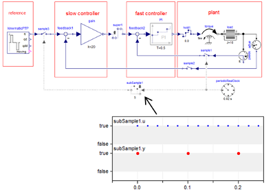

# Modelica_Synchronous

Free library to precisely define and synchronize sampled data systems with different sampling rates. It provides convenient to use blocks to utilize the new synchronous language elements introduced in Modelica 3.3.

## Library description

The `Modelica_Synchronous` library is an open source Modelica package under Modelica License 2 to precisely define and synchronize sampled data systems with different sampling rates. It provides a convenient to use block library to utilize the new synchronous language elements introduced in Modelica 3.3 and was presented at the 9th International Modelica Conference 2012 (“A Library for Synchronous Control Systems in Modelica”).

Features include:
 * Periodic clocks and event based clocks for synchronous execution of clocked partitions (introduced in the Modelica Language Specification 3.3). Therefore, the sample period for a partition needs to be defined only at one location.
 * Definition of multi-rate control systems with elements to sub-sample, super-sample and shift-sample partitions synchronously.
 * Optional simulation of quantization effects, computational delay or noise.
 * Automatic discretization of continuous-time equations for utilization in sampled data systems. This is especially useful to utilize continuous-time nonlinear, inverse models in a discrete-time control system.

It is planned to include this library in a future version of the Modelica Standard Library (after an evaluation period and once several Modelica tools support the synchronous language elements)

## Current release

Download [Modelica_Synchronous v0.92 (2013-09-19)](../../archive/v0.92.zip)

#### Release notes

*  [Version v0.92 (2013-09-19)](../../archive/v0.92.zip)
 * The library uses the latest Modelica Standard Libary (MSL) version 3.2.1 (but still works with version 3.2).
 * Added a couple of convenience source blocks for Real, Integer, and Boolean signals that are similar to the blocks
   found in the MSL, but have as output a clocked signal.
 * Added a couple of source blocks that are parametrized in terms of clock ticks rather than simulation time.
 * All new blocks are utilized in at least one test.
*  [Version v0.91 (2012-09-20)](../../archive/v0.91.zip)
 * The library has been tested with Dymola 2013 FD01:
   * "Check" with "Pedantic = true" is successful (so the library should be completly compatible to the Modelica 3.3 specification).
   * "Check with Simulation" is successful.
   * The tests have a class coverage of 100 % (that is every class of the library is utilized in at least one test).
   * The results of the test models have been either manually checked, or compared with results of the `Modelica_LinearSystems.Controller` or the `Modelica.Blocks.Discrete` library.

## License

This Modelica package is free software and the use is completely at your own risk;
it can be redistributed and/or modified under the terms of the [Modelica License 2](https://modelica.org/licenses/ModelicaLicense2).

## Development and contribution
Release manager: [Martin Otter](http://www.robotic.dlr.de/Martin.Otter)

You may report any issues by using the [Modelica Issue Tracker](https://trac.modelica.org/Modelica/newticket?component=_Modelica_Synchronous).